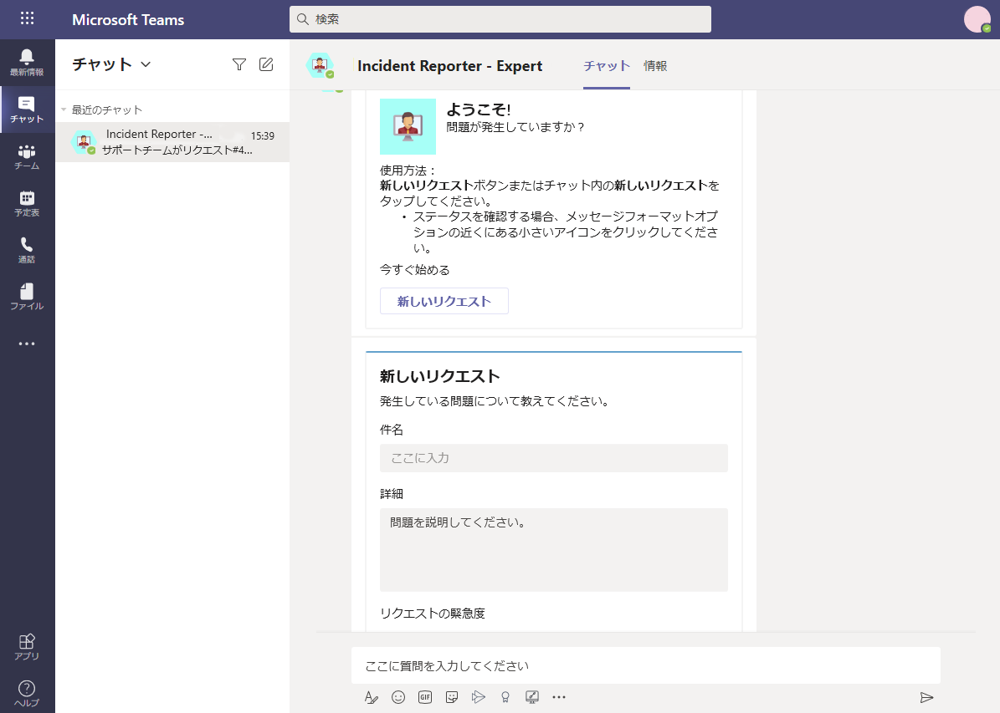
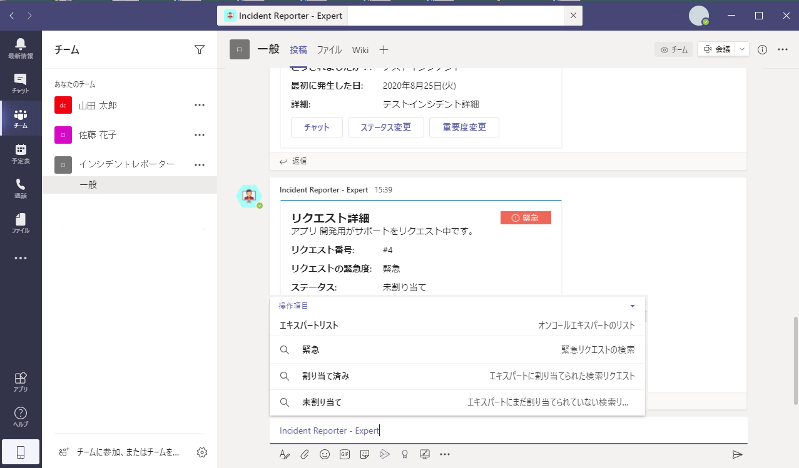

## はじめに

組織内でのインシデント報告やその管理は手動処理で実施されることが多く、効率を向上させる余地があります。報告者は電子メールやアドホックチャネルのようなチャットベースのメッセージを使用して新しいインシデントを関係者に報告することができますが、電子メールやチャットベースのメッセージングシステムは一時的または単発的な性質を持ち、根本原因分析や事後分析をするために報告された情報を簡単に調査することができません。

Microsoft Teamsのインシデントレポーターボットを使用することで、インシデントへの応答、報告、および記録を簡単かつ迅速に実施することができます。つまり、インシデントへの迅速な対応を可能にします。ボットの主な機能は以下の通りです。
- 各インシデントの時間、日付、および場所の自動収集
- ご使用になる職場のニーズに応じてカスタマイズ可能なインシデント報告フォーム
- スペシャリストチーム内でのインシデント報告により、迅速な協力と関係者への通知が可能となり完了まで追跡可能

## 利用方法および展開方法

それぞのガイドをご参照ください。

- 利用方法：[Incident Reporter利用者ガイド](https://github.com/OfficeDevJP/microsoft-teams-apps-incidentreport/releases/download/v1.0.0/Incident_Reporter_User_Guide.pdf)
- 展開方法：[Incident Reporter管理者ガイド](https://github.com/OfficeDevJP/microsoft-teams-apps-incidentreport/releases/download/v1.0.0/Incident_Reporter_Deployment_Guide.pdf)
